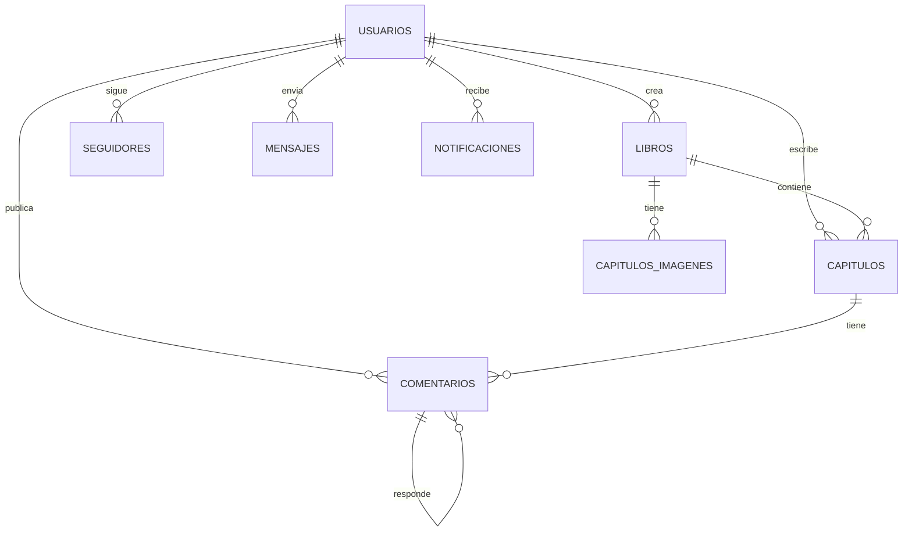
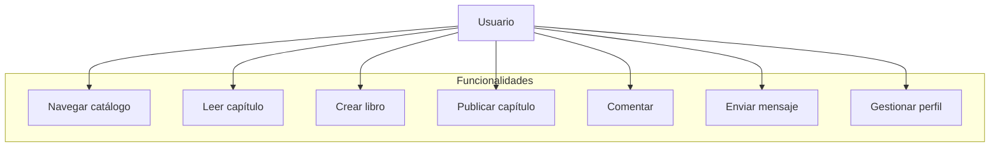
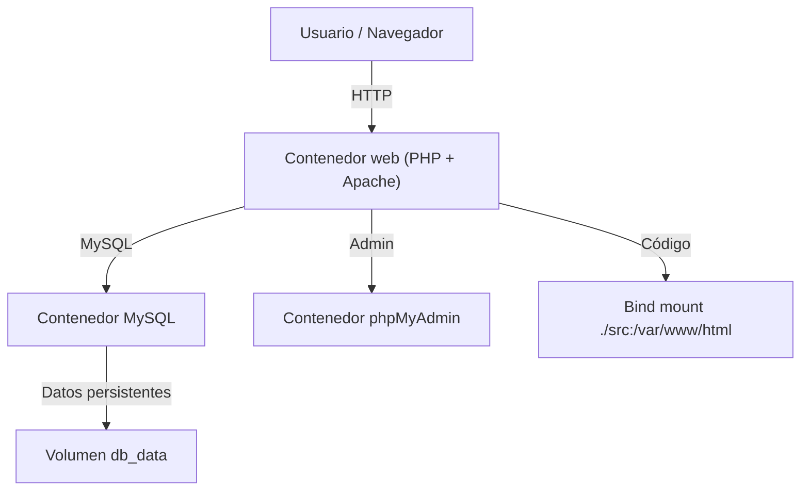

# Memoria Final del Proyecto: El Rincón del Libro

## Portada

**Título del Proyecto:** El Rincón del Libro  
**Autor:** Alba Rodríguez Chito  
**Fecha:** 06/05/2026  
**Centro:** I.E.S. Kursaal  
**Grado:** Desarrollo de Aplicaciones Web  

---

## Índice

1. [Introducción y presentación](#introducción-y-presentación)  
   1.1. [Finalidad del Proyecto](#finalidad-del-proyecto)  
   1.2. [Objetivos](#objetivos)  
   1.3. [Justificación y Motivación](#justificación-y-motivación)  
2. [Diseño lógico y físico de la red](#diseño-lógico-y-físico-de-la-red)  
   2.1. [Diseño Lógico (Arquitectura de Contenedores)](#diseño-lógico-arquitectura-de-contenedores)  
   2.2. [Diseño Físico y Servidor Web/FTP](#diseño-físico-y-servidor-webftp)  
   2.3. [Ampliación de la Red](#ampliación-de-la-red)  
3. [Requisitos HW y SW](#requisitos-hw-y-sw)  
4. [Análisis / Diseño de la app](#análisis--diseño-de-la-app)  
   4.1. [Pantallazos de la APP](#pantallazos-de-la-app)  
   4.2. [Diagramas E/R](#diagramas-er)  
   4.3. [Modelo relacional tablas](#modelo-relacional-tablas)  
   4.4. [Requisitos Funcionales](#requisitos-funcionales)  
   4.5. [Requisitos No Funcionales](#requisitos-no-funcionales)  
   4.6. [Casos de Uso](#casos-de-uso)  
   4.7. [Diagrama de Casos de Uso](#diagrama-de-casos-de-uso)  
   4.8. [Diseño del Sistema](#diseño-del-sistema)  
5. [Manual técnico](#manual-técnico)  
   5.1. [Arquitectura de Sistemas y Stack Tecnológico](#arquitectura-de-sistemas-y-stack-tecnológico)  
   5.2. [Infraestructura de Contenedores (Docker)](#infraestructura-de-contenedores-docker)  
   5.3. [Procedimiento de Instalación (Docker)](#procedimiento-de-instalación-docker)  
   5.4. [Gestión de Almacenamiento y Persistencia](#gestión-de-almacenamiento-y-persistencia)  
   5.5. [Seguridad y Mantenimiento Técnico](#seguridad-y-mantenimiento-técnico)  
   5.6. [Plan de Escalabilidad](#plan-de-escalabilidad)  
   5.7. [Pruebas](#pruebas)  
   5.8. [Planificación de Recursos y Cronograma](#planificación-de-recursos-y-cronograma)  
6. [Manual de usuario](#manual-de-usuario)  
   6.1. [Introducción](#introducción-1)  
   6.2. [Gestión de Cuentas y Registro](#gestión-de-cuentas-y-registro)  
      6.2.1. [Creación de una cuenta](#creación-de-una-cuenta)  
      6.2.2. [Inicio de Sesión](#inicio-de-sesión)  
   6.3. [Guía para el lector (Exploración de Contenido)](#guía-para-el-lector-exploración-de-contenido)  
      6.3.1. [Navegación por el Catálogo](#navegación-por-el-catálogo)  
      6.3.2. [Experiencia de Lectura](#experiencia-de-lectura)  
      6.3.3. [Mi Biblioteca Personal](#mi-biblioteca-personal)  
   6.4. [Guía para el Autor (Panel de Escritura)](#guía-para-el-autor-panel-de-escritura)  
      6.4.1. [Creación de una Nueva Obra](#creación-de-una-nueva-obra)  
      6.4.2. [Publicación de Capítulos](#publicación-de-capítulos)  
   6.5. [Interacción Social y Comunidad](#interacción-social-y-comunidad)  
   6.6. [Modalidades y Formas de Pago](#modalidades-y-formas-de-pago)  
      6.6.1. [Contenido Gratuito](#contenido-gratuito)  
      6.6.2. [Contenido Premium y Características Peculiares](#contenido-premium-y-características-peculiares)  
   6.7. [Accesibilidad y Personalización: El Modo Lectura Nocturna](#accesibilidad-y-personalización-el-modo-lectura-nocturna)  
      6.7.1. [Interfaz “amanecer” (Modo Día)](#interfaz-amanecer-modo-día)  
      6.7.2. [Interfaz “anochecer” (Modo Oscuro)](#interfaz-anochecer-modo-oscuro)  
   6.8. [Seguridad y Privacidad de los Datos](#seguridad-y-privacidad-de-los-datos)  
   6.9. [Resolución de Problemas y Soporte](#resolución-de-problemas-y-soporte)  
7. [Mapa del sitio web](#mapa-del-sitio-web)  
8. [Conclusiones](#conclusiones)  
   8.1. [Propuesta de ampliación](#propuesta-de-ampliación)  
   8.2. [Alternativas de desarrollo](#alternativas-de-desarrollo)  
   8.3. [Presupuestación](#presupuestación)  
9. [Bibliografía](#bibliografía)  
   9.1. [Tecnologías Frontend y diseño](#tecnologías-frontend-y-diseño)  
   9.2. [Tecnologías Backend y Base de Datos](#tecnologías-backend-y-base-de-datos)  
   9.3. [Infraestructura y DevOps](#infraestructura-y-devops)  
   9.4. [Metodologías y Usabilidad](#metodologías-y-usabilidad)  
10. [Anexos](#anexos)  
   10.1. [Código Fuente](#código-fuente)  
   10.2. [Capturas de Pantalla](#capturas-de-pantalla)  

---

## 1. Introducción y presentación

### 1.1. Finalidad del Proyecto

El Rincón del Libro nace como una plataforma web destinada a conectar autores y lectores en un entorno digital de creación, publicación y lectura de libros electrónicos. El objetivo principal es ofrecer una solución integral para que cualquier usuario pueda crear una obra, publicarla en capítulos y recibir feedback de la comunidad.

La finalidad del proyecto se centra en:
- Facilitar la autopublicación y gestión de historias.
- Poner a disposición una experiencia de lectura online accesible desde cualquier navegador.
- Fomentar la interacción entre autores y lectores mediante comentarios, valoraciones y mensajes.
- Generar un entorno seguro para compartir contenido literario y mantener la privacidad del usuario.

### 1.2. Objetivos

Los objetivos del proyecto se dividen en generales y específicos:

**Objetivos generales:**
1. Desarrollar una aplicación web funcional que permita la creación, publicación y lectura de libros.
2. Ofrecer una plataforma con una experiencia de usuario intuitiva y responsive.
3. Usar una infraestructura moderna basada en contenedores para facilitar el despliegue y el mantenimiento.

**Objetivos específicos:**
- Implementar un sistema de registro e inicio de sesión con perfiles de usuario.
- Permitir la creación, edición y eliminación de libros y capítulos.
- Añadir un sistema de comentarios anidados en la comunidad y en capítulos.
- Gestionar contenido gratuito y premium mediante un sistema de monedas virtuales.
- Incluir un modo nocturno para mejorar la accesibilidad visual.
- Incorporar notificaciones y mensajería interna.

### 1.3. Justificación y Motivación

La motivación que impulsa este proyecto es la necesidad de democratizar el acceso a la publicación de obras literarias. En un contexto en el que muchos autores buscan publicar de forma independiente. El Rincón del Libro pretende ofrecer una alternativa sencilla y gratuita para mostrar sus creaciones.

Justificación principal:
- Existen pocas plataformas en el entorno educativo que combinen creación de contenido con comunidad literaria.
- Los autores noveles necesitan herramientas que les permitan estructurar sus historias en capítulos y recibir feedback inmediato.
- Los lectores demandan espacios donde descubrir contenido original, interactuar y guardar sus obras favoritas.

Además, la aplicación se justifica como un proyecto de fin de grado porque integra conceptos de programación web, bases de datos, diseño de interfaces, arquitectura de software y despliegue con Docker.

## 2. Diseño lógico y físico de la red

### 2.1. Diseño Lógico (Arquitectura de Contenedores)

La arquitectura lógica del proyecto se basa en una solución de tres capas:
- Capa de presentación: aplicación web en PHP y HTML/CSS/JS.
- Capa de negocio: lógica de gestión de usuarios, libros, capítulos y comunidad.
- Capa de datos: base de datos MySQL.

El uso de contenedores permite separar servicios independientes:
- Servicio `web`: servidor Apache + PHP.
- Servicio `db`: servidor MySQL.
- Servicio `phpmyadmin`: herramienta de administración de base de datos.

Este diseño facilita el desarrollo y el despliegue, porque cada servicio se puede ejecutar, actualizar y escalar de forma independiente.

### 2.2. Diseño Físico y Servidor Web/FTP

En el diseño físico se representa el despliegue real del software sobre el hardware y la red. El proyecto se propone como un sistema desplegado en un servidor con capacidades suficientes para ejecutar Docker.

Componentes físicos:
- Servidor web con Apache y PHP dentro de un contenedor.
- Servidor de base de datos MySQL en contenedor separado.
- Acceso FTP o SFTP para subir ficheros estáticos si se desplegara fuera de Docker.
- Red local o pública que conecta el navegador del usuario con los servicios.

La configuración del servidor web se mantiene en el contenedor `web`, que expone el puerto 80 hacia el host. Un servidor FTP/SFTP puede usarse para transferencia de archivos de contenido multimedia si el despliegue se migrará a un entorno de producción tradicional.

### 2.3. Ampliación de la Red

Para ampliar la red y soportar más usuarios o servicios adicionales, se propone:
- Añadir un balanceador de carga (Nginx o HAProxy) para distribuir el tráfico web.
- Desplegar la base de datos en un clúster gestionado o réplica maestra/esclava.
- Incorporar un servicio de caché (Redis o Memcached) para sesiones y datos temporales.
- Añadir un servicio de archivos estáticos y multimedia en un almacenamiento externo o CDN.

Con esta ampliación, la red podría escalar horizontalmente y mejorar la disponibilidad.

## 3. Requisitos HW y SW

### Requisitos Hardware

Para el entorno de desarrollo y pruebas:
- CPU: 4 núcleos o superior.
- Memoria RAM: 8 GB mínimo.
- Disco SSD: al menos 50 GB libres.
- Conexión a Internet estable.

Para el entorno de producción:
- CPU: 8 núcleos recomendados.
- RAM: 16 GB o más.
- Almacenamiento: 100 GB SSD o más.
- Copias de seguridad diarias.

### Requisitos Software

- Sistema operativo: Windows 10/11, Linux Ubuntu, macOS.
- Docker Desktop o Docker Engine.
- Docker Compose.
- PHP 8.1 o superior.
- MySQL 8.0 o superior.
- Navegador moderno (Chrome, Firefox, Edge).

Herramientas de desarrollo:
- Editor de código: VS Code.
- Control de versiones: Git.
- Navegador con consola de desarrollador para probar frontend.

## 4. Análisis / Diseño de la app

### 4.1. Pantallazos de la APP

Las capturas de pantalla muestran las pantallas reales de la aplicación y su interfaz coherente con la identidad visual del proyecto.

- **Pantalla de inicio:** contenido destacado, libros recomendados, top valorado y búsquedas rápidas. Esta vista incluye un banner principal con un libro destacado y tarjetas de libros recomendados, como se ve en las capturas de la página principal.
- **Página de catálogo:** filtros por categoría, edad recomendada, estado del libro y búsqueda por autor o título. El catálogo utiliza tarjetas de libros con miniaturas, precio, categoría y valoraciones, lo que facilita la exploración.
- **Perfil de usuario:** muestra estadísticas de lecturas, obras publicadas, seguidores y seguidos. El perfil incluye acceso directo a la información personal y botones de acción cómo «Seguir» o «Dejar de seguir».
- **Panel de autor / escritura:** formulario para crear nuevos libros, definir precio, edad recomendada y estado, además de publicar capítulos con imágenes y contenido. Las capturas muestran el flujo de creación y edición de libros.
- **Pantalla de lectura:** vista de capítulo con botones para añadir a favoritos, dejar de seguir al autor, valoración del libro y sección de comentarios. También permite navegar fácilmente entre capítulos.
- **Comunidad:** chat abierto con mensajes anidados, respuesta a comentarios y opción para subir imágenes. La interfaz de comunidad ofrece un formulario claro para publicar mensajes y ver conversaciones.
- **Modo nocturno:** la aplicación tiene un tema oscuro con fondo negro, bordes rosas y tipografía clara. Esto mejora la accesibilidad en entornos con poca luz.
- **Soporte:** formulario de soporte técnico con campos de correo, asunto y descripción, que facilita la comunicación de incidencias.
- **Notificaciones:** dropdown de notificaciones con mensajes recientes y acceso a la lista completa.

Cada captura refleja la coherencia del diseño y la navegación fluida entre páginas.

> - Pantalla de inicio.


> - Catálogo.


> - Lectura de capítulo.


> - Panel de autor / creación de libro.


> - Comunidad / chat.


> - Modo nocturno.


> - Soporte técnico.


> - Ajustes de perfil.


### 4.2. Diagramas E/R

El conjunto de capturas incluye un diagrama conceptual y otro de entidad-relación, lo que ayuda a visualizar las principales entidades del proyecto.

El diagrama conceptual representa las relaciones fundamentales:
- Usuarios que crean libros.  
- Usuarios que escriben capítulos.  
- Comentarios publicados por usuarios.  
- Seguidores como relación social.  
- Mensajes directos entre usuarios.

El diagrama entidad-relación funcional representa las tablas que se utilizan en la base de datos MySQL y sus claves foráneas.




#### 4.2.1. Diagrama de Casos de Uso




#### 4.2.2. Diagrama de Arquitectura




### 4.3. Modelo relacional tablas

El modelo relacional se basa en una estructura normalizada que refleja la realidad de la aplicación y los datos que se capturan en las capturas.

Principales tablas:

- `usuarios`:
  - `id_usuarios` (PK)
  - `nombre`
  - `email`
  - `password`
  - `avatar`
  - `monedas`
  - `biografia`
- `libros`:
  - `id_libro` (PK)
  - `usuario_id` (FK)
  - `titulo`
  - `descripcion`
  - `precio`
  - `edad_recomendada`
  - `estado`
  - `categoria`
  - `fecha_creacion`
- `capitulos`:
  - `id_capitulo` (PK)
  - `libro_id` (FK)
  - `titulo`
  - `contenido`
  - `orden`
  - `precio`
  - `fecha_publicacion`
- `capitulo_imagenes`:
  - `id_capitulo_imagen` (PK)
  - `capitulo_id` (FK)
  - `ruta_imagen`
- `comunidad_mensajes`:
  - `id_comunidad` (PK)
  - `usuario_id` (FK)
  - `contenido`
  - `archivo`
  - `tipo`
  - `parent_id`
  - `fecha`
- `seguidores`:
  - `id_seguimiento` (PK)
  - `seguidor_id` (FK)
  - `seguido_id` (FK)
- `mensajes`:
  - `id_mensaje` (PK)
  - `emisor_id` (FK)
  - `receptor_id` (FK)
  - `contenido`
  - `fecha`
- `notificaciones`:
  - `id_notificaciones` (PK)
  - `usuario_id` (FK)
  - `mensaje`
  - `url`
  - `leida`
  - `fecha`

Además de las tablas principales, la base de datos puede contener tablas auxiliares para favoritos, bloqueos, historiales y configuraciones de usuario.


### 5. Manual técnico

#### 5.1. Arquitectura de Sistemas y Stack Tecnológico

El stack técnico del proyecto está compuesto por las siguientes capas:
- **Frontend:** HTML5, CSS3, JavaScript y FontAwesome para iconografía.
- **Backend:** PHP 8 con extensiones `mysqli` y `pdo_mysql` para la comunicación con MySQL.
- **Base de datos:** MySQL 8 para almacenamiento relacional.
- **Contenedores:** Docker y Docker Compose para el despliegue.

La estructura del proyecto está organizada de manera clara para separar el código de la lógica y los recursos estáticos. El árbol principal incluye:
- `docker-compose.yml`
- `Dockerfile`
- `src/`
  - `index.php`
  - `login.php`
  - `registro.php`
  - `perfil.php`
  - `catalogo.php`
  - `leer.php`
  - `escribir.php`
  - `comunidad.php`
  - `chat.php`
  - `ajustes.php`
  - `soporte.php`
  - `procesar_*.php`
  - `partials/`
    - `header.php`
    - `footer.php`
  - `CSS/`
    - `style1.css`
  - `img/`
  - `BD/`
    - `01_schema.sql`
    - `02_data.sql`

La arquitectura se muestra en las capturas con un cliente que consume el servidor web y una base de datos independiente. Esta separación facilita actualizaciones sin afectar al frontend.

#### 5.2. Infraestructura de Contenedores (Docker)

Docker permite ejecutar tres servicios aislados:
- `web`: aplicación PHP + Apache.
- `db`: MySQL.
- `phpmyadmin`: administración de bases de datos.

El contenedor `web` usa la ruta `./src:/var/www/html` para el código, lo cual permite ver cambios inmediatos en el navegador.

#### 5.2.1. Configuración del Dockerfile

El `Dockerfile` se basa en la imagen oficial de PHP con Apache, lo que simplifica la configuración del servidor web:
- `FROM php:8.2-apache` como imagen base.
- `RUN docker-php-ext-install mysqli pdo_mysql` para habilitar la conexión con MySQL.
- `RUN a2enmod rewrite` para habilitar `mod_rewrite` y permitir futuras mejoras de URLs amigables.

Esta configuración asegura que el contenedor disponga de PHP, Apache y las extensiones necesarias sin añadir complejidad innecesaria.

#### 5.2.2. Configuración de Docker Compose

El `docker-compose.yml` define la orquestación de los tres servicios y permite montar volúmenes persistentes. Algunas configuraciones clave son:
- `Build: .` en el servicio `web` para crear la imagen de la aplicación usando el `Dockerfile`.
- `Ports: - "8080:80"` para exponer la aplicación en `http://localhost:8080`.
- `Volumes: - ./src:/var/www/html` para sincronizar el código local con el contenedor.
- `Depends_on: - db` para asegurar el arranque ordenado de los servicios.

Para la base de datos, se utiliza la imagen `mysql:8.0` con variables de entorno que definen usuario, contraseña y nombre de base de datos. También se monta el directorio `./src/BD` en `/docker-entrypoint-initdb.d` para inicializar el esquema y los datos con `01_schema.sql` y `02_data.sql`.

El servicio `phpmyadmin` facilita la administración de MySQL con acceso en `http://localhost:8081`.

#### 5.3. Procedimiento de Instalación (Docker)

1. Clonar el repositorio en la máquina.  
2. Abrir terminal en la carpeta del proyecto.  
3. Ejecutar `docker-compose up -d` para levantar los servicios.  
4. Acceder a la aplicación en `http://localhost:8080`.  
5. Acceder a phpMyAdmin en `http://localhost:8081` para inspeccionar la base de datos.

El contenedor de MySQL ejecuta automáticamente los scripts de inicialización `01_schema.sql` y `02_data.sql`.

#### 5.4. Gestión de Almacenamiento y Persistencia

La persistencia de datos en Docker se implementa con:
- Volumen nombrado `db_data` para los datos de MySQL.  
- Bind mount `./src:/var/www/html` para el código fuente.  
- Bind mount `./src/BD:/docker-entrypoint-initdb.d` para los scripts de inicialización.

Los archivos subidos por los usuarios se guardan en el directorio `img/uploads/`, con subdirectorios como `comunidad` para mensajes y `capitulos` para imágenes de capítulos.

#### 5.5. Seguridad y Mantenimiento Técnico

El proyecto contempla varias medidas de seguridad:
- Escape de entradas con `real_escape_string`.  
- Control de acceso en cada página mediante sesiones.  
- Validación de usuario que impide acciones como eliminar mensajes ajenos.  
- Modo oscuro que mejora la legibilidad y reduce la fatiga ocular.

Para mantener el sistema:
- Revisar logs de Apache y MySQL.  
- Actualizar PHP y MySQL regularmente.  
- Realizar backups diarios de la base de datos.  
- Controlar el espacio en disco del volumen de datos.

#### 5.6. Plan de Escalabilidad

Para escalar el proyecto se recomienda:
- Separar el frontend del backend con una API REST.  
- Migrar la base de datos a un servicio gestionado.  
- Usar un CDN para archivos estáticos e imágenes.  
- Añadir un balanceador de carga para múltiples instancias web.

También se puede migrar a microservicios y añadir un servicio de colas para tareas de notificaciones, procesamiento de imágenes y envíos de correo.

#### 5.7. Pruebas

##### 5.7.1. Plan de Pruebas

El plan de pruebas se diseñó para cubrir los principales flujos funcionales del proyecto:
- Registro e inicio de sesión de usuarios.
- Creación, edición y gestión de libros y capítulos.
- Lectura de contenido gratuito y premium.
- Sistema de comentarios y comunidad.
- Recarga de monedas y procesos de pago simulados.
- Gestión de perfil, ajustes y notificaciones.

Se priorizaron los casos de uso más críticos para garantizar una experiencia estable antes del despliegue.

##### 5.7.2. Pruebas Unitarias

Se realizaron pruebas unitarias básicas en funciones clave de validación y procesamiento. Ejemplos de pruebas incluyen:
- Validación de formato de correo electrónico.
- Comprobación de contraseñas válidas y coincidencia de confirmación.
- Verificación de existencia de archivos subidos.
- Validación de campos obligatorios en formularios.

Un ejemplo de prueba puede describirse con una función auxiliar como:
```php
function testValidarEmail() {
    assert(validarEmail('usuario@ejemplo.com') === true);
    assert(validarEmail('usuario') === false);
}
```

##### 5.7.3. Pruebas de Integración

Las pruebas de integración verificaron que los módulos del sistema trabajaran de forma conjunta:
- Registro → creación de libro → publicación → lectura → comentario.
- Conexión entre la aplicación web y la base de datos MySQL.
- Sincronización de datos entre la interfaz y el servidor.
- Gestión de sesiones y permisos de usuario.

Se probó el ciclo completo de uso para detectar errores en validaciones y en consultas SQL.

##### 5.7.4. Resultados

Los resultados de las pruebas mostraron que las principales funcionalidades del proyecto se comportan correctamente. Se corrigieron fallos relacionados con:
- Manejo de sesiones.
- Validación de formularios incompletos.
- Consultas SQL con parámetros incorrectos.

El sistema es estable para un despliegue de desarrollo, y los elementos críticos quedan identificados para futuras mejoras.

#### 5.8. Planificación de Recursos y Cronograma

##### 5.8.1. Fases del Proyecto

El desarrollo de El Rincón del Libro se estructuró en 4 fases principales:

1. **Fase 1: Análisis y Diseño** (1-2 semanas)
   - Definición de requisitos funcionales y no funcionales.
   - Diseño de base de datos (modelo E/R).
   - Diseño de interfaz de usuario.
   - Creación de diagramas de arquitectura.

2. **Fase 2: Desarrollo Backend y Frontend** (4-6 semanas)
   - Creación de tablas y esquema de base de datos.
   - Desarrollo de módulos de autenticación, gestión de libros, lectura, comunidad.
   - Diseño y maquetación de interfaces HTML/CSS/JS.
   - Integración frontend-backend.

3. **Fase 3: Pruebas e Integración** (2-3 semanas)
   - Pruebas unitarias de funciones críticas.
   - Pruebas de integración entre módulos.
   - Pruebas de aceptación del usuario.
   - Corrección de bugs identificados.

4. **Fase 4: Despliegue y Documentación** (1-2 semanas)
   - Configuración de Docker y Docker Compose.
   - Despliegue en entorno de desarrollo.
   - Redacción de documentación técnica y de usuario.
   - Preparación para presentación.

**Duración total estimada:** 8-13 semanas

##### 5.8.2. Cronograma Detallado

| Fase | Actividades | Semanas | Hito |
|------|-------------|---------|------|
| 1 | Análisis, diseño, prototipado | 1-2 | Documentación de requisitos |
| 2 | Desarrollo backend (50%) | 2-4 | DB y APIs funcionales |
| 2 | Desarrollo frontend (50%) | 2-5 | Interfaces implementadas |
| 2 | Integración y testing | 5-6 | Sistema funcional |
| 3 | Correcciones y optimización | 6-8 | Bugs resueltos |
| 4 | Documentación y despliegue | 8-10 | Proyecto finalizado |

##### 5.8.3. Recursos Humanos

Para el desarrollo de este proyecto, se requieren los siguientes roles:

| Rol | Dedicación | Responsabilidades |
|-----|-----------|-------------------|
| **Desarrollador Full-Stack** | 100% | Backend (PHP/MySQL), frontend (HTML/CSS/JS), integración |
| **QA/Tester** | 50% | Pruebas, reportes de bugs, validación de requisitos |
| **Diseñador UX/UI** | 30% | Diseño de interfaz, maquetado, guía de estilos |
| **DevOps/Infraestructura** | 20% | Configuración Docker, despliegue, mantenimiento |
| **Project Manager** | 30% | Coordinación, seguimiento, comunicación |

**Equipo mínimo:** 2 personas (Full-stack + QA)
**Equipo recomendado:** 4-5 personas

##### 5.8.4. Recursos Técnicos

**Hardware:**
- PC de desarrollo: CPU 4 núcleos, 8GB RAM, 50GB SSD libre
- Servidor de producción (opcional): CPU 8 núcleos, 16GB RAM, 100GB SSD

**Software:**
- Docker Desktop (desarrollo)
- Visual Studio Code con extensiones (PHP, MySQL, Docker)
- Git para control de versiones
- phpMyAdmin para gestión de BD
- Navegadores modernos para testing

**Almacenamiento:**
- Repositorio Git (GitHub, GitLab, etc.)
- Base de datos MySQL 8.0+
- Sistema de archivos para uploads de imágenes

**Conexión:**
- Internet estable para descargas y actualizaciones
- Ancho de banda: 100 Mbps mínimo

##### 5.8.5. Herramientas y Tecnologías

| Categoría | Herramienta | Uso |
|-----------|-----------|-----|
| **Programación** | PHP 8.1+ | Backend |
| | HTML5/CSS3 | Frontend |
| | JavaScript | Interactividad |
| **Base de Datos** | MySQL 8.0 | Almacenamiento |
| **Contenedorización** | Docker | Empaquetamiento |
| | Docker Compose | Orquestación |
| **Control de versiones** | Git | Gestión de cambios |
| **Diseño** | Figma | Prototipado |
| **Testing** | PHPUnit | Pruebas unitarias |
| | Postman | Testing de APIs |
| **Documentación** | Markdown | Documentación técnica |
| | MkDocs | Generación de docs |

##### 5.8.6. Gestión de Riesgos

**Riesgos identificados:**

| Riesgo | Probabilidad | Impacto | Mitigación |
|--------|-------------|--------|-----------|
| Retrasos en desarrollo | Media | Alto | Usar metodología ágil, sprints de 1 semana |
| Bugs críticos encontrados tarde | Baja | Alto | Pruebas automatizadas desde fase 2 |
| Cambios en requisitos | Media | Medio | Documentar cambios, revisar con stakeholders |
| Problemas de performance | Baja | Medio | Profiling y optimización en fase 3 |
| Indisponibilidad de herramientas | Muy baja | Bajo | Alternativas preparadas (IDE, hosting) |

## 6. Manual de usuario

### 6.1. Introducción

Este manual describe cómo utilizar El Rincón del Libro, tanto para lectores como para autores. La aplicación ofrece un entorno de publicación, lectura y comunidad, con herramientas de interacción social y un diseño visual consistente en tonos rosas y blancos.

### 6.2. Gestión de Cuentas y Registro

Los usuarios deben crear una cuenta para acceder a funciones avanzadas.

#### 6.2.1. Creación de una cuenta

1. Acceder a `registro.php` desde el enlace de la página principal.  
2. Introducir nombre, correo electrónico y contraseña.  
3. Enviar el formulario con el botón «Registrarse».  
4. Tras completar el registro, se redirige a la página de inicio con el usuario ya conectado.

La pantalla de registro muestra un formulario sencillo, con campos bien espaciados y un botón de acción rosa para facilitar el proceso.

#### 6.2.2. Inicio de Sesión

1. Acceder a `login.php`.  
2. Introducir el correo electrónico y la contraseña.  
3. Pulsar «Entrar» para validar las credenciales.  
4. Si son correctas, se crea la sesión PHP con `usuario_id` y se accede al catálogo o perfil.

La pantalla de login utiliza una interfaz limpia con iconografía del proyecto y una entrada clara para el usuario.

### 6.3. Guía para el lector (Exploración de Contenido)

Los lectores pueden explorar historias, leer capítulos y participar en la comunidad.

#### 6.3.1. Navegación por el Catálogo

La pantalla de catálogo permite buscar por libro, autor o categoría. Incluye filtros de:
- Tipo de contenido (`Libros` o `Usuarios`).  
- Categoría.  
- Estado del libro.  
- Edad recomendada.

Los resultados se muestran en tarjetas con miniaturas, título, autor, categoría, precio y valoración. Las capturas muestran claramente la lista de libros con tarjetas alineadas en cuadrícula.

#### 6.3.2. Experiencia de Lectura

En la página de lectura (`leer.php`), el usuario ve el título del capítulo, nombre del autor y la obra. La interfaz incluye botones para:
- Marcar el libro como favorito,  
- Dejar de seguir al autor,  
- Valorar con estrellas.

El contenido se presenta con texto limpio y espacio en blanco para facilitar la lectura. La sección de comentarios permite publicar opiniones y ver conversaciones relacionadas.

#### 6.3.3. Mi Biblioteca Personal

En la biblioteca, los usuarios encuentran sus libros favoritos, autores seguidos y el historial de lecturas. Las capturas de pantalla muestran tarjetas de libros y capítulos guardados, así como secciones dedicadas a «Libros Favoritos», «Autores Seguidos» y «Historial de Lectura».

### 6.4. Guía para el Autor (Panel de Escritura)

El autor dispone de funciones para crear nuevas obras y gestionar capítulos.

#### 6.4.1. Creación de una Nueva Obra

1. Acceder a `escribir.php` o la sección de creación de libros.  
2. Introducir título, categoría, precio y edad recomendada.  
3. Añadir una imagen de portada opcional.  
4. Pulsar «Publicar Libro» para crear la obra.

La pantalla de creación muestra un formulario con campos claros y un botón de publicar visible.

#### 6.4.2. Publicación de Capítulos

1. Abrir el libro creado en el panel de autor.  
2. Añadir un nuevo capítulo con título y contenido.  
3. Subir una imagen opcional para el capítulo.  
4. Pulsar «Publicar Capítulo».

El panel de autor también muestra los capítulos ya publicados con botones de editar. Las capturas muestran las secciones de «Mis Obras Creadas» y el listado de capítulos con botones de edición.

### 6.5. Interacción Social y Comunidad

La sección de comunidad permite enviar mensajes públicos, responder a otros usuarios y eliminar los propios mensajes. Incluye un chat abierto donde se pueden publicar textos o imágenes.

El flujo es:
- Escribir un mensaje,  
- Adjuntar imagen si se desea,  
- Enviar y ver el mensaje en la lista.  
- Responder a mensajes existentes con el botón «Responder».  
- Eliminar los mensajes propios con el botón «Eliminar».

A su vez, la aplicación dispone de un chat privado entre usuarios, donde se muestra la lista de conversaciones recientes y el formulario para enviar el primer mensaje.

### 6.6. Modalidades y Formas de Pago

El proyecto incluye un sistema de monedas virtuales para gestionar contenido premium.

#### 6.6.1. Contenido Gratuito

Parte del catálogo es accesible sin coste. Los usuarios pueden leer libros gratuitos y participar en la comunidad sin necesidad de recargar monedas.

#### 6.6.2. Contenido Premium y Características Peculiares

El contenido premium se desbloquea con monedas. Algunas características premium incluyen:
- Acceso anticipado a capítulos exclusivos.  
- Compra de libros completos.
- Capítulos de pago con imágenes adicionales.

La pantalla de recarga permite seleccionar un monto y cargar monedas. El catálogo muestra claramente cuando un libro es premium, con el precio visible en la tarjeta.

### 6.7. Accesibilidad y Personalización: El Modo Lectura Nocturna

La aplicación incorpora un modo nocturno para mejorar la experiencia de lectura en ambientes con poca luz.

#### 6.7.1. Interfaz “amanecer” (Modo Día)

El modo día utiliza colores claros y contrastes suaves, con fondos crema y rosa que facilitan la lectura. La mayoría de las páginas mantienen una estética limpia basada en espacios blancos y botones rosas.

#### 6.7.2. Interfaz “anochecer” (Modo Oscuro)

El modo oscuro cambia la paleta a tonos negros y grises, manteniendo texto blanco y botones rosas brillantes. Las capturas muestran el mismo contenido en modo oscuro, con buena legibilidad y un diseño consistente.

### 6.8. Seguridad y Privacidad de los Datos

El Rincón del Libro protege la información del usuario mediante:
- Encriptación de contraseñas (se recomienda usar `password_hash` en futuras versiones).
- Control de sesión para evitar accesos no autorizados.
- Validación de formularios y escape de cadenas para prevenir inyección SQL.
- Políticas de privacidad para no compartir datos sensibles con terceros.

### 6.9. Resolución de Problemas y Soporte

Para resolver incidencias comunes, el usuario puede:
- Comprobar que Docker esté en ejecución.  
- Verificar que el puerto 8080 no esté ocupado.  
- Revisar los logs con `docker-compose logs web` y `docker-compose logs db`.  
- Borrar cookies y volver a iniciar sesión si hay problemas de autenticación.

La aplicación incluye una sección de soporte técnico con un formulario que solicita correo, asunto y descripción del problema.

## 7. Mapa del sitio web

El mapa del sitio describe las páginas principales y su estructura:

- Inicio (`index.php`)
- Catálogo (`catalogo.php`)
- Biblioteca (`biblioteca.php`)
- Escribir (`escribir.php`)
- Comunidad (`comunidad.php`)
- Chat / Mensajes (`mensajes.php`)
- Perfil (`perfil.php`)
- Ajustes (`ajustes.php`)
- Login / Registro (`login.php`, `registro.php`)

Este mapa muestra el flujo de navegación para un usuario registrado y para un visitante.

## 8. Conclusiones

La realización de El Rincón del Libro ha permitido conocer de forma práctica las fases de diseño, implementación y despliegue de una aplicación web completa. El proyecto integra funcionalidades de escritura, lectura, comunidad y pago, lo que lo convierte en una solución educativa y viable.

### 8.1. Propuesta de ampliación

Se proponen las siguientes ampliaciones:
- Desarrollo de apps móviles en React Native o Flutter.
- Traducción e internacionalización.
- Añadir revisiones y métricas para autores.
- Integrar redes sociales para compartir extractos.

### 8.2. Alternativas de desarrollo

Alternativas tecnológicas consideradas:
- Usar Laravel o Symfony como framework PHP.
- Migrar MySQL a PostgreSQL para mayor flexibilidad.
- Utilizar React o Vue.js en el frontend.
- Desplegar en Kubernetes o servicios gestionados en la nube.

### 8.3. Presupuestación

Estimación de costes:
- Desarrollo: 22.500 €
- Infraestructura anual: 9.650 €
- Mantenimiento anual: 10.000 €
- Total primer año: 42.150 €

La inversión inicial incluye diseño, desarrollo backend/frontend, arquitectura y pruebas, mientras que los costes recurrentes cubren hosting, base de datos gestionada y soporte.

## 9. Bibliografía

### 9.1. Tecnologías Frontend y diseño

1. PHP Manual. (2023). https://www.php.net/manual/
2. FontAwesome. (2023). https://fontawesome.com/

### 9.2. Tecnologías Backend y Base de Datos

1. MySQL Documentation. (2023). https://dev.mysql.com/doc/
2. Docker Documentation. (2023). https://docs.docker.com/

### 9.3. Infraestructura y DevOps

1. Docker Compose. (2023). https://docs.docker.com/compose/
2. Best practices for Docker.

### 9.4. Metodologías y Usabilidad

1. Principios de diseño UX.
2. Guías de accesibilidad web WCAG.
